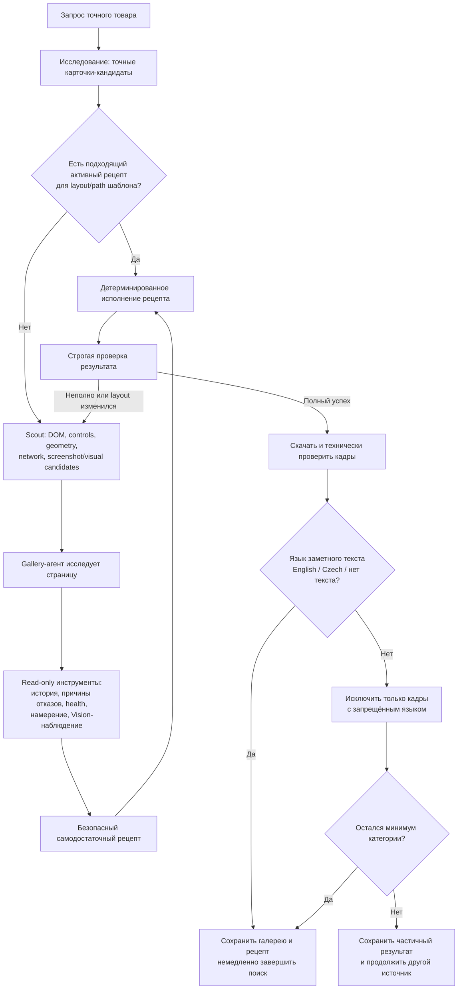
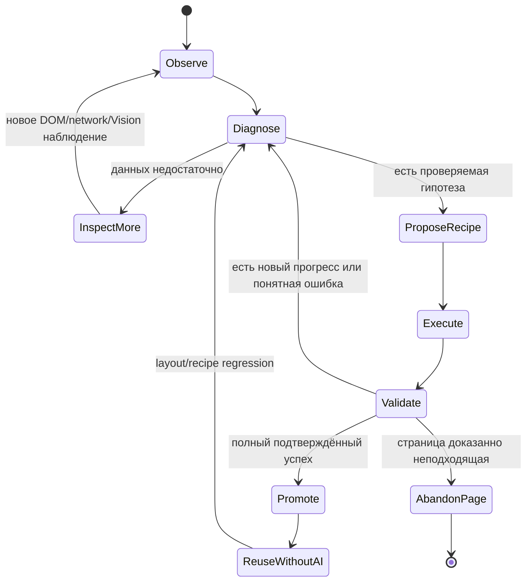

# Стратегия проекта Ningredy

Этот файл — единый источник истины для продуктовой стратегии и обязательных правил проекта. Перед изменением поиска товаров, изображений, AI-рецептов или Telegram-интерфейса необходимо сверяться с ним.

## Главная цель

Ningredy не пытается заранее написать универсальный парсер для всех магазинов. Главная стратегия — **обучение проверяемых Playwright-рецептов**:

1. На незнакомой странице AI-агент получает полную наблюдаемую ситуацию: очищенный DOM, элементы управления, геометрию, сетевые изображения, историю действий, технические отказы и при необходимости визуальные наблюдения.
2. Агент самостоятельно разбирается в конкретной механике страницы, выбирает только разрешённые безопасные действия, запускает проверяемую гипотезу и оценивает фактический результат.
3. Приложение детерминированно исполняет план, проверяет безопасность, точную идентичность товара, полноту галереи, происхождение URL, загрузку, размеры и дубли. Рассуждение агента не заменяет фактическую проверку.
4. Успешный план сохраняется как версионируемый рецепт для подходящего шаблона страниц домена. Следующий товар с тем же подтверждённым шаблоном обрабатывается без AI.
5. Если сохранённый рецепт перестал работать, система не маскирует сбой успехом: передаёт агенту наблюдаемый разрыв, позволяет локально исправить рецепт, проверяет новую версию и сохраняет предыдущую для отката.

Целевой результат — не отсутствие ошибок на любых сайтах, а автономный цикл **увидел → предположил → безопасно попробовал → измерил → исправил → запомнил**, в котором неизвестная ситуация становится повторяемым рецептом, а одинаковая проблема не оплачивается AI заново для каждого товара.

## Блочная карта системы

### Ответственность блоков

| Блок | Сам решает | Детерминированная граница |
|---|---|---|
| Исследование товара | Какие точные карточки проверить | Одна конкретная конфигурация, строгие SKU/MPN/GTIN и запрет смешивания источников |
| Browser Scout | Какие наблюдения собрать | Только очищенные данные страницы; никаких скрытых решений о галерее |
| Gallery-агент | Как интерпретировать страницу, какое безопасное действие проверить и когда сменить гипотезу | Не исполняет произвольный код, не покупает, не вводит данные и не объявляет успех без валидации |
| Playwright runner | Исполняет разрешённый план и измеряет изменения | Allowlist действий, безопасная навигация, точная трасса, свежий браузер для каждой проверки |
| Валидатор | Подтверждает полноту, provenance и техническую пригодность | Только наблюдаемые факты; текст рассуждения агента не считается выполнением |
| Память рецептов | Повторно применяет и версионирует удачный способ | Рецепт выбирается по домену и подтверждённому шаблону страницы, проверяется перед доверием и может быть откачен |
| Оркестратор | Продолжает, восстанавливает или меняет источник | Один источник за раз, общий бюджет, отсутствие бесконечных повторов, немедленный stop после успеха |

## Целевой цикл автономности агента

Автономность означает право агента выбирать следующий **безопасный способ получить недостающее наблюдение**, а не право обходить ограничения приложения. Если нужного типа наблюдения или действия нет в инструментах, улучшается инструментальный контракт, а не добавляется частное правило конкретного магазина в prompt.

## Критерии успеха стратегии

- Первый неизвестный layout может потребовать AI и нескольких проверяемых раундов; повторный совместимый layout использует рецепт без AI.
- Рецепт считается знанием только после реального исполнения и строгой проверки, а не потому что агент убедительно его описал.
- Ошибка сохранённого рецепта запускает локальную диагностику и новую версию, а не полный поиск вслепую и не вечное отключение всего домена после одного сбоя.
- Полная точная галерея завершает поиск немедленно; внутреннее целевое число фотографий не заставляет ходить по другим сайтам.
- Неопределённость, timeout, invalid response и tool failure остаются техническими состояниями и никогда не превращаются в семантическое «галереи нет».
- Каждая новая возможность агента сопровождается allowlist, наблюдаемым результатом, аудитом, лимитом повторов и тестом безопасного отказа.

## Приоритеты развития автономности

Это целевая последовательность, а не утверждение, что все пункты уже реализованы:

1. **P0 — маршрутизация нескольких рецептов одного домена.** Рецепт выбирается не по одному `domain + *`, а по подтверждённому сочетанию path/layout/region/device-варианта. Новый layout создаёт отдельную ветку рецепта и не портит рабочую версию другого шаблона.
2. **P0 — явный протокол следующего шага агента.** Помимо `propose_recipe` и `abandon_page`, агент может вернуть `inspect_more` с конкретным безопасным наблюдением: аннотированный screenshot/crop, дополнительный DOM после scroll/hover/wait, shadow DOM, iframe metadata или сетевой payload. Приложение исполняет только allowlist и возвращает измеримый diff.
3. **P0 — отдельный language-only Vision-контракт.** Финальная проверка подтверждённого слайдера имеет собственную схему без полей publishable/exact_match/color/rank: только язык заметного текста, уверенность и необходимость повторить с большей детализацией.
4. **P1 — структурированная память домена.** Автоматические знания хранятся не свободным текстом, а фактами `scope/evidence/confidence/first_seen/last_verified/successes/failures`. Устаревшее наблюдение теряет доверие; ручная подсказка оператора остаётся отдельной и приоритетной.
5. **P1 — составные и условные рецепты.** Consent/interstitial, открытие viewer, traversal и extraction становятся независимыми проверяемыми блоками. Рецепт может безопасно выбрать одну из наблюдаемых веток layout, но не содержит произвольного JavaScript.
6. **P1 — canary и rollback.** Новая версия сначала проверяется на текущей странице и, когда доступны сохранённые безопасные fixtures того же layout, на небольшом наборе регрессий. Провал не затирает последнюю рабочую версию; выбор автоматически откатывается.
7. **P2 — replay/eval-корпус реальных проблем.** Очищенные scout/action/network traces и разрешённые тестовые изображения превращаются в воспроизводимые сценарии: layered viewer, lazy slider, responsive duplicates, recommendations, redirect, WAF, protected CDN, unusual aspect ratio и language gate.
8. **P2 — операторский Strategy/Recipe dashboard.** Визуально показывает путь `observed → training → validating → active → degraded → rolled back`, выбранный layout, версию рецепта, последний успех/сбой, действия агента и причину следующего шага.

### Основные классы проблем сайтов

| Проблема | Типичный симптом | Что должно помочь агенту |
|---|---|---|
| Несколько layout одного домена | Селектор рабочего рецепта внезапно ничего не находит | Layout-aware routing и отдельная версия, а не перезапись общего `*` |
| Вложенный viewer/zoom/tab | Видны только 1–2 thumbnail или низкое разрешение | Новое DOM-наблюдение после каждого слоя и полный replayable action plan |
| Lazy/virtualized carousel | DOM содержит только текущий кадр | Безопасные scroll/click-until-no-change/wait и network diff |
| Hover, shadow DOM, iframe | Контрол существует визуально, но отсутствует в обычном scout | Явный inspect_more для hover/shadow/iframe metadata |
| Recommendations/reviews рядом | В набор попадают чужие товары | Семантический media scope, provenance каждого URL и подтверждение единого контейнера |
| Один корпус у разных SKU | Vision «узнаёт» ноутбук, но не конфигурацию | SKU/MPN/title/spec evidence страницы; Vision не является доказательством SKU |
| CDN renditions и protected URLs | Дубли либо HTTP не скачивает браузерный кадр | Asset key, browser-context transfer, точная причина download failure |
| Эффекты, боковой ракурс, узкий detail | Полезный кадр ошибочно считается баннером | Доверие подтверждённому слайдеру; финальный Vision смотрит только язык текста |
| CAPTCHA/locale/redirect/A-B | Повторяется бесполезный рецепт или блокируется весь домен | Отдельная классификация transient/block/layout, scoped retry и смена источника |
| Нет наблюдаемого прогресса | Агент повторяет тот же selector | Progress signature, история попыток и обязательная смена гипотезы |

## Визуальная документация

- Каноническими остаются требования в этом файле; Mermaid-блоки рядом с текстом версионируются вместе с кодом и отображаются как диаграммы в GitHub и совместимых IDE.
- Для полноценного динамического сайта следующий безопасный шаг — **MkDocs Material + Mermaid**: он строит навигацию и сайт прямо из `PROJECT_STRATEGY.md` и будущих ADR, не создавая вторую копию требований.
- Крупные изменения стратегии оформляются короткими ADR в `docs/decisions/` и ссылаются отсюда: контекст, решение, альтернативы, последствия и дата. ADR объясняет, почему правило изменилось; этот файл по-прежнему говорит, какое правило действует сейчас.
- Операционные данные не следует вручную копировать в документацию. Живые статусы рецептов, success/failure rate, layout fingerprint и traces показываются в Filament Strategy/Recipe dashboard из базы.

## Как работать с противоречиями

1. Если новый запрос противоречит правилу из этого файла, AI сначала сообщает пользователю точное противоречие.
2. Пока пользователь явно не подтвердил изменение правила, действует записанная здесь логика.
3. После явного изменения решения этот файл обновляется в рамках той же задачи.
4. Нельзя молча заменять требования внутренними лимитами, предположениями или «более удобной» реализацией.

## Граница ответственности AI-агента и приложения

- Инструкции, определяющие рассуждение и решения API-агента, пишет только предусмотренный API-агент. В рамках разработки приложения запрещено вручную «лечить» его ошибки дописыванием частных правил, примеров и интерпретаций в prompt/instructions без отдельной явной команды пользователя.
- Наша зона ответственности — детерминированное окружение агента: входные данные, инструменты, схемы и валидация результата, лимиты и таймауты, HTML/DOM/Playwright-сбор, техническая проверка изображений, аудит, повторные попытки и fallback-сценарии.
- Исследователь товара получает актуальный список активных категорий из базы при каждом запросе и сам выбирает ближайшую подходящую категорию только из этого списка. Его Structured Outputs всегда отправляются в OpenAI с strict=true, поэтому несуществующий category slug не может пройти контракт и обрушить уже выполненный поиск; частные правила соответствия товаров категориям в коде не зашиваются.
- Каждая категория хранит настраиваемую оператором совместимость с общим product_type (laptop, desktop, component или other). Эта метаинформация передаётся исследователю вместе с живым списком категорий и проверяется до сохранения черновика. Если выбранная категория противоречит типу и для него существует ровно одна активная совместимая категория, приложение исправляет категорию детерминированно; при нескольких вариантах причина возвращается агенту на ограниченную бюджетом коррекцию, а не решается частным hardcode.
- Если агент ошибается или пропускает галерею, сначала исправляется окружение, контракт, сбор данных, проверка результата или оркестрация. Частные ответы под конкретный товар или сайт в инструкции агента не зашиваются.
- Базовый инвариант отказоустойчивости: технический сбой, таймаут, ограничение провайдера, невалидный ответ, исключение инструмента или неполный результат никогда не маскируются под успешное семантическое решение (found, no_gallery, static_sufficient, рабочий рецепт или окончательный отказ). Приложение сохраняет точную стадию, входные данные, уже выполненные действия, DOM/сетевые наблюдения, частичный результат и причину сбоя как состояние interrupted, после чего в пределах общего бюджета передаёт этот диагностический контекст ответственному AI-агенту и предоставляет ему возможность самостоятельно переоценить ситуацию, исправить план, повторить безопасный шаг, сменить метод либо источник и продолжить поиск. Пользователь получает окончательную ошибку только после исчерпания применимых автоматических способов восстановления или общего лимита; одинаковая попытка без нового наблюдаемого прогресса не повторяется бесконечно.

## Поиск товара

- Если товара нет локально или пользователь просит найти его в интернете, поиск в интернете запускается без лишнего уточнения.
- Если конфигурация не указана, выбирается актуальная нормально доступная новая конфигурация точной модели.
- Результат исследования обязан описывать одну продаваемую конфигурацию, а не семейство: нужен точный SKU/MPN/GTIN либо однозначная карточка конкретного retail offer, а установленные CPU/GPU/RAM/storage/display/color/pack count не могут содержать альтернативы, varies by SKU или список вариантов. Детерминированная проверка возвращает найденные нарушения исследователю максимум на две автоматические коррекции в пределах общего времени и стоимости; после исчерпания восстановления неоднозначный черновик не создаётся.
- По умолчанию ищется только новый товар. Used, refurbished, renewed, recertified и open-box разрешены только по явному запросу.
- Уточняющий вопрос допустим только при реальной неоднозначности личности товара, а не из-за неуказанных RAM, SSD, цвета или комплектации. Очевидная опечатка в известном бренде или модели исправляется без вопроса; ответы «любой», «любая» и «сам выбери» требуют немедленно продолжить поиск с автоматически выбранной актуальной новой конфигурацией.
- После запуска интернет-исследования `ProductResearch` никогда не возвращает уточняющий вопрос: он самостоятельно выбирает наиболее подходящий актуальный новый товар по всем указанным признакам, автоматически определяет неуказанные бренд/комплектацию/формат поставки и завершает этап только результатом `found` либо `not_found`.
- `ProductResearch` подтверждает личность товара, характеристики и точные HTML-страницы-кандидаты, но не обязан извлекать из них URL всей галереи. Прямые `image_urls` являются необязательными seed; их отсутствие не превращает найденный товар в `not_found`, потому что слайдер после исследования отдельно открывает Playwright.
- У производителя, официального сайта, маркетплейса и магазина нет искусственного приоритета. Источники ранжируются по реальной успешности получения подходящей карточки и галереи.
- Регион домена, TLD и locale-сегмент URL не являются причиной отклонять точную товарную карточку: источник из любой страны разрешён, если он подтверждает нужный товар. Язык самой HTML-страницы также не является основанием терять чистую товарную галерею. Языковое ограничение относится к содержимому фотографий: кадр без заметного текста разрешён, а кадр с крупным или композиционно значимым текстом публикуется только когда этот текст английский или чешский. Универсальная маркировка самого товара, короткие model/SKU/технические обозначения и мелкий фоновый текст не считаются причиной отклонения.
- Если найденный товар по бренду/модели/названию точно совпадает с уже опубликованным товаром каталога, новый черновик не создаётся. Вместо текстового ответа AI-агента детерминированно (кодом, а не словами модели) отправляется настоящая карточка этого товара из каталога: фото и актуальные данные, а не пересказ.
- Для запроса с указанной серией, моделью или SKU совпадение только по бренду и типу товара недостаточно: локальный каталог обязан подтвердить указанные идентификаторы. MSI Katana не может быть заменён другим ноутбуком MSI вроде MSI Vector.
- Таймаут или ошибка интернет-исследования не считаются найденным товаром и не разрешают ослаблять исходный запрос при повторной проверке локального каталога. После исчерпания точных попыток система сообщает об ошибке, а не отправляет похожую карточку.
- Для Web Search действует два разных ограничения: большой абсолютный лимит разрешает продолжать реально активный поиск, а лимит бездействия останавливает поток, если провайдер не присылает ни сетевых данных, ни событий. Локальный таймер интерфейса не считается активностью и не продлевает ожидание.
- Агентный Web Search может выполнить несколько поисковых вызовов внутри одного ответа, пока модель проверяет источники. Каждый уникальный вызов определяется по provider item ID из потока, сохраняется в usage и включается в денежный лимит поиска вместе с токенами; декларативный лимит SDK, который OpenAI не получает, не считается защитой бюджета.
- Исследование товара через OpenAI Responses передаёт провайдеру реальные детерминированные ограничения: не более 12 встроенных Web Search-вызовов (max_tool_calls) и не более 16 000 выходных токенов (max_output_tokens) на ответ. Первый этап является широкой разведкой и целится в 6–12 точных HTML-карточек разных доменов, начиная с явных model/SKU/MPN/EAN/UPC; галереи на этом этапе не раскрываются. Потолок 12 оставляет небольшой запас над наблюдавшимся рабочим максимумом 11, но не позволяет одному ответу разрастись до десятков вызовов, исчерпать TPM организации и затем целиком повториться после rate limit.
- Резервный Web Search фотографий также передаёт OpenAI реальный лимит: не более 6 встроенных поисковых вызовов и 12 000 выходных токенов. Основной Telegram-агент ограничен 16 000 выходных токенов, а Vision, предфильтр и тренер Playwright-рецепта — 8 000 каждый; лимит завершает текущий ответ, а не ставит его на возобновляемую паузу.
- Все тяжёлые вложенные OpenAI-этапы (исследование товара, резервный поиск фото, Vision, предфильтр и обучение рецепта) проходят через один общий межпроцессный lock. Одновременно выполняется только один такой этап; внешний Telegram-агент в lock не входит, потому что он вызывает эти этапы как инструменты и иначе заблокировал бы сам себя.

## Единый источник карточки

- Одна карточка товара собирается из одного логического товарного источника. Внутренние вкладки и маршруты этого же товара на том же домене (`/Specification`, `/Gallery`, медиамодалка и аналогичные представления) считаются одной карточкой, если после перехода детерминированно подтверждается тот же товар. Переход на категорию, поиск, другой товар, другой домен или страницу без подтверждаемой связи с исходной моделью запрещён.
- Описание, характеристики и фотографии должны относиться к одной точной модели, конфигурации, ревизии корпуса, цвету и состоянию.
- Нельзя смешивать фотографии разных сайтов или независимых товарных карточек. Разрешённые внутренние вкладки одного логического источника не являются смешиванием страниц.
- Если на странице нет подходящей информации или полноценной галереи, страница целиком пропускается и проверяется следующий источник.
- После успешного получения карточки и галереи поиск по другим источникам немедленно прекращается.

## Фотографии

- Галерея содержит до 10 пригодных фотографий. Это максимум, а не обязательная квота.
- Нельзя ходить по другим сайтам ради достижения внутреннего числа фотографий.
- Используются полноразмерные профессиональные фотографии производителя или магазина нового товара.
- Не используются пользовательские фотографии, объявления б/у товаров, повреждённые экземпляры, логотипы, баннеры, аксессуары и другой цвет или корпус.
- Миниатюры, заглушки и дубли отбрасываются. Разные размеры одного изображения считаются дублем.
- При команде «найти другие фото» предыдущие изображения и источники этого черновика заносятся в его список исключений и не повторяются.
- Замена одного конкретного фото — точечная дешёвая операция, а не полный пересбор галереи: используется только статичный HTML исходной страницы, Playwright не запускается и рецепт не переобучается. Если страница ничего нового не даёт, следующий шаг — AI веб-поиск по бренду/модели (не повтор той же статичной страницы), с той же проверкой Vision. Полный пересбор галереи через Playwright доступен отдельным действием «Все фото».

## Playwright и AI-рецепты галерей

- Исследователь выбирает категорию из актуального списка базы, а приложение детерминированно применяет настроенную у этой категории стратегию фотопоиска: `Авто`, `Vision-first` или `Playwright-first`. Настройка находится в Filament в карточке категории. Для `components` по умолчанию используется `Vision-first`, для `laptops` и `computers` — `Playwright-first`, для остальных и новых категорий — `Авто`.
- У категории также настраиваются минимальное количество проверенных фото, минимальная ширина, минимальная высота и необязательная доверенная подсказка поисковому агенту. Для существующих категорий минимум количества по умолчанию 3, для `components` — 1; это порог успешного завершения, а не верхняя квота. Размеры, явно выставленные оператором в карточке категории, являются авторитетными для этой категории; пустые значения наследуют глобальные настройки 700 px по ширине и 0 по высоте. Подсказка видна исследователю и Vision, но не может отменить проверку точной модели, цвета, качества и безопасности.
- В режиме `Playwright-first` последовательность такая: Web Search подтверждает товар и возвращает точные HTML-страницы-кандидаты → приложение проверяет источники по одному, не смешивая их → обычный HTML-сборщик дешёво собирает прямые URL и признаки галереи как входные данные → обязательный AI-предфильтр оценивает страницу → при наличии реальной галереи Playwright обучает или исполняет лучший доступный рецепт → техническая проверка подтверждает загрузку, размеры и отсутствие дублей. Если точная модель/SKU источника и единый полный слайдер подтверждены, его кадры проходят только финальный language-only Vision-гейт из раздела «Проверка изображений»; семантического покадрового отбора модели/ракурса/полезности больше нет. Статичные URL являются seed/fallback и не должны безусловно отключать Playwright своим количеством.
- В режиме `Vision-first` приложение собирает статичные URL из карточек и исполняет уже существующий активный рецепт домена, если он есть, после чего технически пригодные кадры проверяются Vision. Новый Playwright-рецепт и переобучение сломанного рецепта в этом режиме не запускаются; при недостатке фото используется резервный Web Search с той же Vision-проверкой. Кадры сломанного готового рецепта не считаются доверенными и проходят Vision.
- В режиме `Авто` сохраняется общий стандартный Playwright-first сценарий. Playwright не запускается, когда предфильтр обоснованно вернул `no_gallery`/`blocked`, источник недоступен, исчерпан бюджет либо выбран `Vision-first` и для домена нет активного рецепта.
- Перед дорогим Playwright приложение выполняет дешёвый HTTP-preflight всех карточек: полностью исключает только явно недоступные (404/410) и явно заблокированные по домену карточки; собирает статичные оригиналы, отмечает готовый активный рецепт и пересортировывает кандидатов. Карточка, у которой дешёвый запрос словил 401/403/429 или явную JS/cookie-заглушку, не исключается — headless-браузер часто проходит там, где простой HTTP-запрос блокируется, — а лишь теряет вес по количеству найденных статичных доказательств; при прочих равных она ранжируется выше карточки с тем же нулевым результатом, но без объяснения причины. Новый AI-рецепт обучается только на лучшей перспективной карточке; остальные страницы используют статику или уже существующий рецепт, после чего переходят в Vision/fallback.
- Если HTML, JSON, `data-imageurl`, `srcset` или другие данные страницы уже содержат полноценные фотографии, они сохраняются как проверяемый резерв на случай сбоя Playwright и одновременно передаются предфильтру как доказательства структуры галереи.
- Настройка Filament «Обучать Playwright даже когда статики "достаточно"» по умолчанию включена. Поэтому вердикт `static_sufficient` при найденной настоящей галерее (`gallery_likely`) не считается окончательным: рецепт всё равно обучается, реально исполняется и технически проверяется. Отключение настройки является явным дешёвым режимом, а не стандартным поведением.
- До вызова AI обычный код проверяет признаки галереи: повторяющиеся элементы товара, миниатюры, `x of N`, carousel/slider, массивы изображений и full-resolution атрибуты.
- AI не вызывается только ради вопроса «есть ли галерея», когда ответ однозначно определяется DOM или данными страницы.
- Если признаки галереи есть, но получены не все оригиналы либо требуется взаимодействие, Playwright Scout собирает очищенный DOM, интерактивные элементы и сетевые image-запросы.
- Полезный gallery/media-контрол считается достаточным основанием продолжить обучение даже при отсутствии галерейных DOM-фрагментов на текущем экране. AI может выбрать безопасный переход по внутренней вкладке того же товара, после чего получает новый DOM следующим раундом.
- В неоднозначном случае AI возвращает: наличие галереи, ожидаемое количество изображений, селектор открытия, селекторы миниатюр/стрелки, атрибут или сетевой источник full-resolution URL, уверенность и объяснение.
- Рецепт предназначен для извлечения всей галереи в full resolution, а не одного главного изображения.
- При обнаружении многоизображенческого слайдера Playwright до обхода миниатюр сначала пытается открыть его увеличенный viewer/lightbox/fullscreen: через явный media/zoom/view-all контрол, а при его отсутствии — безопасным кликом по крупнейшему видимому главному фото. Открытый медиаслой становится приоритетной областью сбора; из него перебираются все фото-миниатюры/стрелки и выбираются максимальные рендиции из `currentSrc`, `srcset`, full-resolution data-атрибутов и image-запросов сети. Глобальные meta/JSON-картинки страницы не считаются кадрами подтверждённого строгого слайдера; страничные миниатюры используются только как fallback, если viewer открыть не удалось.
- Если выбор следующей миниатюры сбрасывает вложенное увеличение, рецепт выражает единый проверяемый цикл `каждая миниатюра → after_each zoom/enlarge → сбор URL`. Сервер собирает после каждого вложенного клика и не принимает набор низких rendition как полный успех, когда в открытом медиаслое наблюдается неиспользованный контрол увеличения.
- То же правило «fallback, а не дополнение» действует и когда взаимодействие вообще не требуется: если один селектор уже детерминированно даёт full-resolution URL на каждое фото из `expected_image_count` (например, зум-ссылки самого слайдера, `actions` пуст), второй селектор (в т.ч. синхронизированная лента миниатюр того же слайдера — `asNavFor` и подобные паттерны) не добавляется в `collect_selectors`/`thumbnail_selectors` — это не независимый источник, а те же кадры через второй DOM-путь. Второй селектор добавляется только когда его собственная доказательная база показывает, что он реально даёт фото, отсутствующие у первого.
- Если галерею нужно открыть, нажать миниатюры, стрелку или модальное окно, AI должен описать эти действия в безопасном декларативном JSON-рецепте.
- Для обучения AI получает очищенный DOM, интерактивные элементы, сетевые изображения, URL и диагностику страницы.
- Playwright исполняет рецепт, а отдельный валидатор проверяет реально скачанные уникальные полноразмерные изображения.
- Если DOM показывает несколько элементов галереи, результат из одного изображения не считается успешным рецептом.
- Активировать и считать полным рецепт можно после фактической проверки целевого числа уникальных кадров. Если строгий DOM/viewer и рецепт достоверно показывают размер галереи, цель равна этому числу с учётом общего максимума 10: результат 5 из 13 не является полным и не получает доверие без Vision. Настраиваемый в Filament минимум (по умолчанию 3) используется только как запасной порог, когда размер галереи нельзя детерминированно установить; это не квота и не разрешение прекращать обход явно большей галереи.
- Рабочий рецепт сохраняется и повторно используется для подходящего шаблона сайта. При изменении сайта рецепт автоматически переобучается.
- Полный JSON-рецепт, объяснение AI и уверенность должны храниться и отображаться в Filament.
- Причина блокировки Playwright классифицируется. Бессмысленные повторные обучения на стабильно заблокированном домене не допускаются.
- Оператор может вручную запустить переобучение источника текущего черновика из Telegram (подменю «🔗 Источник»), в том числе с произвольной текстовой подсказкой о конкретной проблеме («путает модели», «берёт не тот цвет») — подсказка передаётся AI-тренеру как доверенная заметка (в отличие от содержимого страницы) и имеет приоритет над общими эвристиками. Старый рецепт и фото остаются, пока новый кандидат не пройдёт живую проверку.
- Для каждого домена может храниться постоянная редактируемая в Filament подсказка о неочевидной механике галереи. Она является отдельной настройкой домена, переживает очистку тестовых рецептов и передаётся как доверенная заметка и обязательному предфильтру, и тренеру Playwright. Подсказка направляет исследование, но не зашивает CSS-селектор, не отменяет проверку текущего DOM, безопасности, идентичности товара и фактического улучшения разрешения; одноразовая подсказка оператора для конкретной страницы имеет приоритет.
- Автоматические заметки, которые тренер сохраняет по итогам прошлых попыток домена, хранятся отдельно от ручной подсказки оператора. Они являются недоверенной гипотезой: агент обязан заново подтвердить её текущими DOM/action/network-доказательствами; она не может переопределять ручную подсказку, текущую страницу, идентичность товара, безопасность навигации или техническую проверку изображения. Количество таких заметок ограничено, ручной текст AI не изменяет.

## Проверка изображений

- Подтверждение структуры Playwright-галереи не снижает требования к разрешению: принадлежность кадра точному товарному слайдеру доказывает источник и полноту, но не делает маленькое изображение качественнее. Все кадры независимо от источника обязаны пройти единые минимальные ширину и высоту, а также технические проверки декодирования и дублей. Ограничение формы/соотношения сторон не применяется к кадрам подтверждённого монолитного слайдера: узкая фотография портов, боковой профиль или другая деталь остаётся валидным кадром, если проходит минимальные ширину/высоту и безопасно декодируется.
- Полная Playwright-подтверждённая галерея получает структурное доверие только когда источник детерминированно подтверждает точную запрошенную модель/SKU и не содержит конфликтующего близкого идентификатора; проверка содержания при этом всё равно выполняется по следующему гибридному правилу. Доверие по идентификации/структуре ограничено одним слайдером одной страницы одного источника в рамках одного поиска и не переносится на статичные кандидаты, другой источник или следующий цикл поиска. Оператор всё равно проверяет черновик перед добавлением в каталог и может отклонить фото вручную.
- Структурная полнота слайдера сама по себе не доказывает, что кадры показывают сам товар: та же разметка может содержать производственную историю, сравнение конфигураций/SKU, рекомендации или другой контент. AI-тренер обязан подтвердить точную карточку по URL/заголовку/SKU/MPN/характеристикам, единство медиаконтейнера по DOM/action/count/network-доказательствам и принадлежность кадров самому товару (`content_confirmed_product=true`). Если пиксели важны для понимания страницы, тренер по собственной необходимости вызывает read-only Vision-инструмент только на реально наблюдённых URL. На этапе исследования инструмент может сообщать, виден ли товар на фоне эффектов/lifestyle-сцены и в необычном ракурсе, согласуются ли кадры и есть ли визуальная неоднозначность. Он не выбирает, не ранжирует и не отбрасывает кадры, не придумывает селекторы и не доказывает точный SKU по внешне одинаковому корпусу; точная идентичность остаётся обязанностью страницы и агента. Неопределённый либо технически неудачный ответ сохраняет неопределённость и никогда не приводит к тихой потере фотографий.
- После того как точная страница, монолитный товарный слайдер и полный фактический обход подтверждены агентом, Vision больше не оценивает модель, цвет, ракурс, фон, эффекты, композицию или полезность кадров. Финальный Vision-гейт проверяет **только заметный текст внутри пикселей каждого уникального кадра**: разрешены отсутствие текста, английский и чешский; кадр с крупным или композиционно значимым текстом на другом языке исключается. Мелкая фоновая надпись, обычный бренд/model/SKU и универсальные технические сокращения не являются нарушением. Если язык нельзя уверенно определить из-за масштаба, система повторяет проверку с большей детализацией/кропом и не отклоняет кадр молча.
- Все остальные уникальные технически пригодные кадры подтверждённого слайдера принимаются без покадрового семантического отбора. Допустимы профессиональные lifestyle/feature-кадры, люди, эффекты, необычные/боковые/задние/верхние ракурсы, закрытый/сложенный товар, детали и рендеры. Если после исключения кадров только по языковому правилу остаётся минимум категории, источник немедленно становится победителем и обход прекращается; иначе сохраняется частичный результат и проверяется следующий источник. Если агент не подтвердил монолитность/содержание, набор не режется Vision по одному кадру: источник остаётся неподтверждённым, и поиск продолжается.
- Пока остаются разрешённые страницы-кандидаты Web Search, статичный или неподтверждённый набор первой страницы не отправляется в Vision и не останавливает обход: система сначала ищет подтверждённый Playwright-слайдер на следующих страницах. Если страницы не дали такого слайдера, Vision последовательно проверяет до трёх лучших технически пригодных наборов независимых страниц до достижения категорийного минимума; фотографии разных страниц не смешиваются.

- Обычный код до любого AI-решения проверяет доступность, MIME-тип, декодирование и размеры изображения, затем удаляет точные и визуальные дубли.
- Vision запускается только для уникальных технически пригодных кандидатов, которые не входят в доверенный точный Playwright-слайдер: статичных/неподтверждённых изображений страницы и разрозненных результатов резервного поиска.
- Vision подтверждает точную модель, корпус, ревизию и цвет товара.
- Допускаются только профессиональные фотографии нового товара. Аксессуары, логотипы, баннеры, заглушки, пользовательские фото и изображения повреждённых товаров отклоняются.
- Товар не должен быть критически обрезан; основные фотографии должны показывать сам продукт.
- Базовый технический минимум публикации задаётся независимо по фактической ширине и высоте файла; предпочтительны фотографии 800–1200 px и больше. Чистые фотографии среднего размера допустимы при соблюдении обоих порогов, а совсем мелкие превью, размытые и заметно пикселизированные изображения отклоняются.
- Глобальная минимальная ширина и минимальная высота настраиваются двумя компактными полями в Filament на странице «Настройки → AI», а карточка категории может переопределить любой из этих порогов. Эффективные пороги категории единообразно применяются при Playwright-извлечении, обычной загрузке, статичном и резервном поиске, Vision и проверке перед публикацией. Фото проходит при width >= minimum_width и, если minimum_height больше нуля, height >= minimum_height. Значение minimum_height = 0 отключает минимальное ограничение по высоте. Проверки декодирования и дублей сохраняются всегда; эвристика явно непригодной формы сохраняется для неподтверждённых/статичных кандидатов, но не удаляет кадры подтверждённого монолитного слайдера. Глобальные значения по умолчанию — ширина 700 px и высота 0 (авто/без минимального ограничения).
- Разные размеры одного кадра считаются дублем. При сомнительном визуальном совпадении изображение отклоняется.
- Основная защита от дубля «то же фото, другой размер» — отдельный ключ физического ассета до скачивания (по наблюдаемым CDN-паттернам: Adobe Scene7 `wid/hei`/именованный пресет, Amazon `._SXNN_`, ASUS CDN, Shopify `width`/`height` query и filename-суффиксы, числовые WxH/Nw-сегменты, каталоги рендиций `/large/`/`/xlarge/`, filename-рендиции одного UUID вроде `_720`/`_sea` и JPEG/AVIF одного UUID). Этот ключ используется только для группировки и выбора лучшего из реально обнаруженных вариантов и никогда не становится URL скачивания. Приложение не угадывает, не конструирует и не пробует увеличенные URL: скачивать разрешено только адреса, фактически наблюдённые в HTML/DOM/srcset/data-атрибутах/inline-handler, сетевом трафике, payload либо реальном Playwright-взаимодействии. Если защищённый CDN требует cookies/referer/browser-session, Playwright передаёт уже загруженные и технически проверенные байты из того же browser context. Perceptual hash после скачивания — дополнительная страховка. Каждый новый сайт может использовать ещё не описанную схему идентичности ассета — это открытый список; правила ключа обязаны совпадать в `scripts/product-gallery-utils.mjs::imageAssetKey()` и `ProductImageStorage::imageAssetKey()`.
- URL-ключ и perceptual hash являются основной детерминированной дедупликацией. Для неподтверждённых статичных/резервных наборов общий Vision может дополнительно заметить повторную рендицию, когда CDN-ключ не распознал новый формат URL; для подтверждённого монолитного слайдера финальный Vision-контракт ограничен языком текста и не решает дедупликацию.
- AI, обучающий Playwright-рецепт, может абсолютно верно понять структуру галереи в тексте своего рассуждения (реальный кейс: во 2-м раунде корректно описал «шесть отдельных assets») — это не гарантирует, что рецепт физически их достанет. Между пониманием AI и реальным сбором стоит детерминированный раннер (URL-нормализация, гейт по DOM-ключам, probe по минимальному размеру), который ничего не «понимает», а сравнивает строки по заранее прописанным правилам — если правило для конкретной CDN-платформы не написано, понимание AI до результата не долетает.

## Настраиваемые лимиты и отказоустойчивость

- Поведение резервных источников зависит от настройки Filament. При выключенной настройке проверяется только первая выбранная страница; при включённой после полного провала можно перейти к следующей странице. Фотографии разных страниц всё равно не смешиваются. По умолчанию настройка включена — это сознательный выбор: остановить уже начатый поиск вправе только денежный/временной лимит или подтверждённый технический сбой (таймаут, недоступность страницы), но не сам факт провала одного источника при ещё живом бюджете и непроверенных карточках в списке. Выключение этой настройки — единственное осознанное исключение из этого правила и должно оставаться редким осознанным решением оператора, а не случайно забытым состоянием.
- Общий цикл поиска имеет настраиваемый дедлайн (по умолчанию 1800 сек), который обязан быть короче жёсткого таймаута джобы и лока `WithoutOverlapping`, а те — короче таймаута самого queue worker (`run-queue-worker.bat`). Все три цифры меняются вместе, не по отдельности.
- Web Search товара может ждать до 900 сек (15 минут) — обоснованно: реальные успешные завершения на медленных запросах наблюдались вплоть до ~520 сек, короткий лимит рискует оборвать почти готовый ответ впритык.
- Часть общего времени резервируется на сохранение черновика, очистку временных файлов и отправку ответа Telegram. После входа в резерв новые источники, обучение и необязательные AI-вызовы не запускаются.
- Web Search товара, резервный Web Search, Vision, обучение рецепта, Playwright Scout и выполнение рецепта имеют отдельные настраиваемые таймауты.
- Фактический таймаут операции ограничивается оставшимся рабочим временем общего цикла.
- Таймаут или ошибка необязательного резервного поиска не должны перезапускать весь уже выполненный цикл. Система сохраняет доступный результат либо корректно завершает карточку без галереи.
- Денежный лимит одного поиска по умолчанию составляет `$0.50` и настраивается в Filament.
- Денежный лимит проверяется только между товарными источниками и перед запуском нового резервного AI-поиска. Уже начатый источник является атомарным: его HTML/Playwright Scout, уже стартовавший раунд обучения рецепта (не будущие раунды — см. ниже), выполнение рецепта, загрузка и проверка текущей галереи доводятся до результата, даже если в процессе сумма пересекла лимит. Как только уже есть проверяемый набор и потрачено 70% лимита, новые домены Playwright не обучаются: остаток резервируется для Vision и резервного поиска. После полного лимита новые платные источники не запускаются; сохраняется лучший уже полученный результат.
- Число раундов обучения рецепта Playwright (AI ↔ раннер) не имеет обычного фиксированного потолка — только денежный и временной бюджет текущего поиска вправе его остановить, тот же принцип, что и для резервного AI-поиска ниже. Настройка «Раундов AI ↔ Playwright» в Filament — не повседневный лимит, а запасной потолок на случай, когда стоимость в принципе нельзя измерить (тесты, модель без настроенной цены, бюджет выключен, нет `telegram_update_id`) — тогда используется именно она. Раунд, который уже начался, доводится до конца; следующий не стартует, если бюджет исчерпан. Одинаковое количество или набор фото в соседних раундах не является доказательством застоя: DOM, выполненные действия и причина отказа могут измениться, поэтому такой результат передаётся агенту для следующего исправления и сам по себе не останавливает обучение.
- Начиная со 2-го раунда обучения (после того как хотя бы одно действие уже кликнуто) DOM-снимок, отправляемый AI (`extract-product-gallery.mjs::captureInteractionScout`), сужается до подтверждённого media-контейнера (галерея/слайдер/карусель/вьюер), а не пересобирается заново по всей странице — реальный случай без сужения: снимок 2-го раунда вырос с ~55КБ до ~79КБ вместо уменьшения, потому что новые элементы открывшегося вьюера добавлялись поверх уже совпавших на исходной странице, а не заменяли их. Сужение применяется только когда внутри media-контейнера реально нашлось хоть что-то — пустой результат означает, что эвристический селектор контейнера промахнулся мимо настоящего на этой конкретной странице, и тогда используется несуженный список, чтобы не спрятать от AI саму галерею. Первый (ещё до всякого клика) снимок никогда не сужается.
- Если поиск остановлен денежным или временным лимитом до получения целевой галереи, pending-черновик показывает кнопку «▶️ Продолжить поиск». Каждое нажатие явно выдаёт отдельную новую порцию бюджета и времени, не повторяет `ProductResearch`, сохраняет прежние фото как страховку до успешной замены, повторяет последний незавершённый источник и исключает терминально проверенные страницы. Старый Telegram-альбом и служебное меню удаляются на время продолжения, а то же progress-сообщение редактируется дальше; защита от двойного запуска обязательна.
- `gallery_search_stop_reason` знает третье значение — `exhausted`: текущий проход перебрал известные карточки и резервный AI-веб-поиск без целевой галереи, но общий денежный и временной бюджет запуска ещё не исчерпан. Такой проход автоматически и строго по одному ставит следующий `continueStage()` с тем же общим бюджетом и исключением терминально проверенных URL; пользователь не обязан нажимать кнопку после каждого пустого прохода. Атомарная уникальность задачи и overlap-lock не допускают параллельных либо накопленных дубликатов продолжения. Автоматическая цепочка прекращается только при успехе, денежном лимите или временном лимите; после лимита черновик остаётся `pending_review` и получает ручную кнопку, которая выдаёт новый бюджетный цикл.
- При rate limit AI-провайдера повторная попытка ждёт ровно столько, сколько указал сам провайдер (`Please try again in Ns` / заголовок `Retry-After`), с буфером пару секунд и пределами 5–900 сек; фиксированный backoff используется только когда провайдер не сообщил время. Промежуточная retryable-ошибка не отправляется отдельным Telegram-сообщением: пользователь продолжает видеть уже созданный прогресс и получает итоговый ответ. Только после исчерпания автоматических попыток отправляется одна окончательная ошибка.
- Скопированная пользователем строка прогресса (`⏳ 12с · запрос · лимит 300 сек.`) очищается от таймера и хвоста «лимит N сек.» на входе webhook, чтобы бот не искал сам мусор копипасты.
- Шаг «Web Search товара» показывает кнопку «❌ Отменить поиск» на время ожидания. Это мягкая отмена: заблокированный HTTP-запрос к AI-провайдеру физически нельзя прервать из другого запроса, поэтому нажатие не останавливает уже летящий запрос и не экономит время/токены — оно лишь помечает результат так, что когда ответ (успешный или нет) всё же придёт, черновик по нему не создаётся и ничего не публикуется. Кнопка исчезает, как только шаг завершается любым способом.

## Telegram

- После успешного добавления товара существующий альбом черновика сохраняется. В его подписи меняется только первая строка: «Черновик готов» заменяется на финальное подтверждение «Товар добавлен в каталог»; описание, характеристики, эмодзи, источники и строка расходов остаются без изменений. Новый дублирующий альбом не отправляется.
- Отдельное служебное сообщение с кнопками управления после успешного добавления удаляется. Ошибка удаления кнопок не отменяет добавление товара.

- Пользователь получает одну карточку: альбом фотографий с описанием и характеристиками.
- Кнопки принятия, отмены и управления фотографиями отправляются следующим служебным сообщением, если Telegram не позволяет прикрепить их к медиагруппе.
- Каждая строка характеристики в любой карточке (черновик или опубликованный товар) начинается с эмодзи по типу характеристики (🧠 процессор, 🎮 видеокарта, 💾 память, 💽 накопитель, 🖥 экран и т.д. — общий список), а не с голого «•». Единица измерения не дублируется, если она уже присутствует в тексте значения.
- У черновика есть не более одного активного служебного сообщения с клавиатурой («разовое меню»): переход между экранами одного черновика (главное меню, выбор фото и т.п.) переиспользует его редактированием на месте, а не плодит новые сообщения.
- Действия с источником черновика собраны в подменю «🔗 Источник»: переобучить рецепт, переобучить с текстовой подсказкой (следующее сообщение оператора перехватывается как подсказка, а не как новый поиск) и забанить источник целиком (с подтверждением). Кнопка `draft:retrain:{id}` прежних карточек продолжает работать как алиас «переобучить без подсказки», чтобы уже отправленные в чат карточки не ломались.
- Как только клавиатура использована (выбран пункт меню), это служебное сообщение удаляется целиком, а не просто теряет кнопки — мёртвые сообщения без действия не остаются в чате.
- При старте нового цикла обзора черновика (новый альбом отправлен заново) прежнее служебное сообщение удаляется, а не переиспользуется под новый альбом — оно привязано к конкретному циклу, не к черновику вообще.
- Команда /reset отменяет зависшие необработанные обновления текущего чата и сбрасывает состояние диалога, не требуя перезапуска воркера.
- После принятия обязательно отправляется подтверждение добавления товара в каталог.
- Длительные этапы показывают действие, прошедшее время и лимит. Для потокового Web Search пользователю показываются подтверждённые события провайдера (подключение, запуск/выполнение/завершение поиска), а время последней реальной активности сохраняется в аудите; имитация работы одним локальным счётчиком запрещена.
- Загрузка фото всегда завершается явной итоговой строкой («📦 Итог: N фото из статичной HTML-галереи / через AI-переобучение Playwright-рецепта / через резервный поиск», с пометкой частичного результата) и хотя бы одной полной кликабельной URL фактически выбранной карточки товара, а не только именем домена. Промежуточные шаги (в т.ч. неудачные, вроде отказа Playwright) не должны оставлять немую яму между последней ошибкой и финальным «черновик готов».
- Подпись расхода: `🔢 Примерно токенов потрачено: N (~$X)`.
- Telegram callback для действия над черновиком считается действительным только из актуального control message этого черновика в сохранённом чате. Старое сообщение не может управлять новой записью с таким же числовым ID после очистки тестовой базы; такая кнопка отклоняется как устаревшая. При тестовой очистке счётчик `product_drafts` больше не сбрасывается и ID черновиков не переиспользуются.
- Каждая отложенная задача поиска, пополнения, переобучения или обработки фотографий хранит не только `draft_id`, но и исходный `telegram_update_id` конкретного поколения черновика. Если запись с таким числовым ID была заменена, задача завершается до любого изменения файлов, фотографий или источников. Все вложенные попытки resolver/Playwright/AI текущего цикла обязательно допривязываются к `product_draft_id`, даже когда цикл запущен новым callback-update через «Продолжить поиск».
- Стандартная очистка данных для нового ручного теста выполняется командой `php artisan catalog:reset-test-data --force`: она удаляет товары, черновики, обученные рецепты, статистику источников и временное состояние диалога, но сохраняет настройки доменов и их AI-подсказки, общие настройки и API-ключи, пользователей, категории, бренды, Telegram updates, AI runs/operations и историю source attempts. Auto-increment/`sqlite_sequence` эта команда не сбрасывает.

## Расходы и тестирование

- Нельзя выполнять лишние платные AI-запросы ради тестирования.
- Для проверки кода сначала используются локальные unit/feature-тесты, фейки и сохранённые fixtures.
- Реальные AI-вызовы выполняются только когда без них нельзя проверить изменённую интеграцию или пользователь явно запросил такой тест.

## Диалог AI и Playwright

- Перед каждым обучением рецепта обязателен отдельный AI-предфильтр. Он возвращает одно решение: статических фото достаточно, обучать Playwright, галереи нет, страница заблокирована либо это не изолированная карточка товара. Обучение запускается только по решению train_playwright.
- Ошибка провайдера, таймаут, невалидная схема или исключение AI-предфильтра являются отдельным состоянием interrupted, а не решениями static_sufficient/no_gallery. В этом состоянии семантическое правило страницы не создаётся, обучение не запускается, реальные static/network наблюдения остаются provisional-кандидатами, а источник сохраняется для повторной попытки.
- Если активный строгий рецепт выполнил обязательный actions-план, вернул не меньше минимума технически проверенных разных кадров и каждый кадр имеет provenance recipe_dom, это окончательный успешный результат источника: он принимается сразу без предфильтра и переобучения. Пустой снимок селекторов, сделанный до открытия viewer, не может отменить более сильное post-action подтверждение.
- AI обязан отличать точную карточку товара от семейного/маркетингового лендинга, списка, сравнения, редакционной или служебной страницы. Упоминание нужной модели само по себе не доказывает карточку. Для терминального отказа нужны высокая уверенность и не менее двух независимых структурных доказательств; неоднозначность не является основанием выбрасывать источник.
- Подтверждённая неподходящая страница запоминается только как точный нормализованный путь домена и исключается до следующего дорогого Playwright-запуска. Это не бан домена и не wildcard по похожей вёрстке: другие карточки того же сайта продолжают проверяться, а layout fingerprint хранится лишь для аудита.
- Основная единица кэша — один подтверждённый layout-рецепт домена и все совместимые с ним нормализованные path-области. Вместе с ним сохраняются регион, пример пути и layout fingerprint — SHA-256 от устойчивых селекторов галереи/медиаконтролов без текста и полного HTML. На новом path система сначала без LLM пробует до трёх наиболее успешных активных рецептов этого домена и строго проверяет фактическую галерею и совпадение селекторов. Успех привязывает новый path к существующему рецепту; новый рецепт и AI-обучение разрешены только после проверенного провала подходящих рецептов или фактического несовпадения селекторов/вёрстки.
- Playwright Scout передаёт AI не только очищенные DOM-фрагменты, но и структурированный accessibility-подобный снимок: видимые кликабельные элементы с безопасным CSS-селектором, количеством совпадений, текстом/ARIA/href, геометрией и связью с медиаблоком, а также видимые изображения с натуральными/экранными размерами, full-resolution data-атрибутами и селектором родительского контрола. Это позволяет видеть иконки и неанглоязычные контролы без передачи модели произвольного управления браузером.
- Для сложной галереи AI может вернуть упорядоченный декларативный `actions`-план. Разрешены только ограниченные клики по CSS-селекторам: один элемент, последовательный обход совпадений либо повтор до отсутствия изменений; у шага есть индекс, предел повторов, ожидание и цель. Произвольные JavaScript/XPath, ввод, формы, покупки и неподтверждённая навигация запрещены. После каждого шага Playwright собирает фото и возвращает AI точную трассу изменения DOM/сети; непустой `actions`-план заменяет старый фиксированный порядок кликов, а старые рецепты без него продолжают исполняться совместимо.
- Каждый шаг непустого `actions`-плана обязателен и исполняется полностью в указанном порядке: количество уже найденных URL не может досрочно завершить план. Один технически не выполнившийся элемент `click_each` журналируется, но не обрывает попытки нажать остальные совпадения; сам план при этом остаётся неполным и уходит агенту на исправление. Рецепт не публикуется и не считается рабочим, если обязательный селектор отсутствует или небезопасен, клик не выполнен, opener не открыл медиаслой, `click_each` не прошёл все найденные элементы в пределах лимита либо `click_until_no_change` не дошёл до неизменившегося состояния или своего лимита. Сырые DOM/thumbnail URL не заменяют трассу исполнения и техническое подтверждение декодирования и размеров полноразмерных кадров.
- Карусели рекомендаций, похожих/спонсируемых товаров, cross-sell/upsell, блоки отзывов и customer media никогда не являются галереей текущего товара. DOM Scout, управляющие действия и сбор URL обязаны отбрасывать их по семантическому контексту ближайшего самостоятельного блока, даже если внутри используются обычные `carousel`/`slider` классы.
- Строгий рецепт принимает только URL, реально найденные его `collect_selectors` в DOM целевой галереи; сетевые запросы, payload и глобальные запасные селекторы не могут незаметно дополнять такой результат. Для каждого принятого URL валидатор требует provenance `recipe_dom`. После lazy-load и каждого завершённого взаимодействия DOM собирается повторно.
- Явный `actions`-план исполняется без скрытых автоматических кликов: автоматическое открытие viewer допустимо только для legacy-рецепта без плана либо когда сам план содержит opener. Фильтр видео/360 применяется к отдельному media item, а не ко всему родительскому контейнеру смешанной фото/видео-галереи.
- Обучение многораундовое, количество раундов настраивается в Filament (по умолчанию 3) и остаётся запасным потолком безопасности. Каждая проверка рецепта запускается новым браузерным процессом с исходной URL и чистым состоянием страницы. После каждого материального клика Playwright возвращает AI новый очищенный post-interaction DOM, трассу действий, сетевые изображения, выполненный рецепт и результат проверки, но этот DOM является только диагностическим наблюдением, а не стартовым состоянием следующего запуска.
- После каждого раунда AI заново оценивает тип страницы по исходному и post-interaction DOM и может обоснованно завершить именно этот URL как неподходящий. Независимо от ответа AI три подряд одинаковых наблюдаемых результата без новых уникальных фото, нового DOM-состояния или успешного перехода останавливают текущую страницу и переводят поиск к следующему источнику. Любой материальный прогресс сбрасывает счётчик; это не глобальная остановка поиска и не фиксированный лимит всего запроса.
- Если первый клик лишь открыл следующий слой, AI строит следующий рецепт по новым миниатюрам, модальному окну, zoom-элементам или стрелкам, но возвращает полный самодостаточный план от исходной страницы: повторяет успешные обязательные действия, открывающие этот слой, и затем исправляет неудачный шаг. Приложение детерминированно возвращает в исправленный рецепт успешный начальный префикс обязательных одиночных кликов, если агент его пропустил. Одинаковое неудачное действие нельзя бесконечно повторять.
- Переход между внутренними маршрутами одного товара разрешён только внутри того же домена и после детерминированной проверки принадлежности целевого URL тому же товарному корню. Само отличие pathname не считается уходом с товара; неподтверждённый маршрут немедленно откатывается и журналируется.
- Видео и 360-медиа полностью игнорируются: они не входят в AI-контракт, счётчики, журналируемый результат, кандидаты на скачивание, Vision или Telegram. Сборщик распознаёт их только для немедленного пропуска и считает исключительно фотографии.
- Сырые URL из HTML не считаются успешным извлечением источника до технической загрузки и проверки. Они не должны отключать Playwright только своим количеством.

## Идентификаторы и детерминированная маршрутизация поиска

- Поля варианта `sku`, `mpn`, `gtin` являются каноническими коммерческими идентификаторами. Исследователь обязан возвращать проверенные SKU/MPN/EAN/UPC как характеристики; при публикации EAN/UPC нормализуются в GTIN. Серийный номер отдельного физического экземпляра в карточку каталога не сохраняется.
- Отдельное Telegram-сообщение, похожее на модель электроники или конфигурацию (бренд/семейство, смешанный буквенно-цифровой код, CPU/GPU/RAM/SSD/частота/объём), детерминированно требует первого tool-call: локальный `SearchCatalog`, затем при отсутствии точного совпадения `ResearchProduct`. Команды управления существующими фото и общие вопросы этим правилом не перехватываются.

## Аудит, блокировки и частичный успех

- Каждый источник и каждое действие сохраняются в журнале: полная URL, решение Web Search/AI, CSS-селектор и результат клика Playwright, DOM до/после, загрузка, Vision-решение, длительность и причина отказа. Журнал доступен отдельной нативной таблицей Filament.
- Отключение Playwright и полная блокировка источника являются разными состояниями. Временная ошибка или сломанный рецепт не запрещают обычный HTML-поиск. Подтверждённая стабильная CAPTCHA/WAF блокирует весь источник до ручного снятия блокировки и исключает его ещё до Web Search/обработки результатов.
- Источник можно забанить и вручную из Telegram (подменю «🔗 Источник» → «🚫 Не использовать источник», с обязательным подтверждением) — использует тот же признак блокировки, что и автоматическое обнаружение CAPTCHA/WAF, и действует на весь домен целиком (не на одну страницу), для всех будущих товаров, а не только текущего черновика. Отличается лишь причина в журнале.
- Один и тот же товар использует фотографии только одного логического источника; наборы разных сайтов или независимых товарных карточек не смешиваются. Внутренние вкладки подтверждённо того же товара относятся к тому же источнику.
- Резерв является внутренним отдельным набором одного источника: фотографии, URL страницы и точная причина, почему набор пока не стал победителем. Резервы разных источников никогда не смешиваются; полный победитель удаляет остальные резервы, а при отсутствии полной галереи лучший допустимый резерв может стать явно помеченным частичным результатом.
- Если точная карточка на любом этапе, включая резервный поиск, дала опубликованный Playwright-рецепт и технически загруженную подтверждённую галерею не меньше минимума категории, после обязательного language-only Vision-гейта эта карточка немедленно становится победителем. Её фотографии нельзя вытеснять общим лимитом URL, повторно отправлять на семантический Vision-отбор или продолжать после неё обход других источников.
- `download_candidates` является только ранним предохранителем ресурсов для сырых и неподтверждённых URL. Подтверждённый монолитный Playwright-слайдер проходит загрузку целиком без этого обрезания; после технических проверок и language-only Vision применяется итоговый максимум фотографий категории, сохраняется допустимое количество кадров и поиск немедленно завершается.
- Результаты браузера, загрузочные слоты и Vision-проверка распределяются по логическим товарным страницам, а не одним глобальным списком изображений. Страница с большим количеством сырых thumbnail/rendition URL не может занять все слоты и вытеснить следующую точную галерею; редирект и фактический DOM-контекст проверяются на исходный model/SKU до расходования её загрузочных слотов.
- Если полная галерея не получена, система сначала исчерпывает разрешённые раунды, страницы, загрузку и Vision. После этого лучший набор из 1–2 проверенных фото разрешено сохранить как частичный успех с явной пометкой в черновике и Telegram вместо аварийного падения.
- Набор для частичного успеха собирается только из результатов реальных попыток текущего цикла обучения. Повторная сверка уже сохранённого (и уже отклонённого в этом же цикле) рецепта не используется как источник частичного успеха — она не более достоверна, чем попытка, которая и вызвала переобучение.
- Крах процесса Playwright (необработанное исключение, разрыв контекста при навигации и т.п.) не должен приводить к потере уже собранных на этот момент фотографий: система отдаёт частичный проверяемый результат вместо полного провала попытки.
- При команде найти фотографии заново в blacklist черновика добавляются принятые фото, perceptual hash, исходная страница и все страницы, уже проверенные в предыдущем цикле. Следующий поиск не повторяет их.

## Непрерывность резервного поиска и подтверждение идентичности

- Жёсткими идентификаторами считаются только model/SKU/MPN/EAN/UPC, которые оператор действительно написал в исходном запросе. SKU, найденный или выведенный исследователем, является полезным доказательством, но не может отклонить точную региональную карточку с другим суффиксом. HTTP-preflight перед проверкой источника добавляет к URL и поисковому заголовку фактические title, h1, OpenGraph, itemprop и JSON-LD идентификаторы загруженной страницы.
- Резервный поиск фотографий в обычном рабочем режиме не имеет отдельного фиксированного количества раундов. Каждый пустой или недостаточный проход создаёт новый независимый Web Search, исключает все уже проверенные страницы/домены и повторяется до достижения минимума категории, денежного лимита или общего временного лимита. fallback_search_rounds является предохранителем для тестов, запуска без денежного бюджета и отдельного случая, когда денежный лимит настроен, но не может быть измерен (у используемой в поиске модели не указана цена, стоимость посчитать нечем) — иначе отсутствие цены незаметно превращается в отсутствие ограничения.
- Настроенная у категории стратегия Vision-first, Playwright-first или Авто, её минимальное количество фото и поисковая подсказка применяются не только к страницам первого исследования, но и к каждой карточке, найденной резервными проходами.
- Право обучить новый Playwright-рецепт определяется только стратегией категории и состоянием домена, а не порядковым номером источника. В Playwright-first/Авто второй и последующий точный источник имеют то же право на обучение, что и первый; в Vision-first новый рецепт не обучается ни на каком индексе, но активный проверенный рецепт разрешён.
- Preflight ранжирует доказательства качества, а не сырое количество найденных URL. Подтверждение точного идентификатора, выбранная исследованием primary-карточка, активный рецепт и необходимость браузерной проверки важнее числа статических ссылок; достижение минимума статикой является только булевым сигналом, не соревнованием «у кого thumbnail больше».
- При маршрутизации точный активный рецепт `domain + нормализованный path_pattern` или ранее подтверждённая совместимая path-область получает полный приоритет. Если точной привязки нет, наличие активных рецептов того же домена даёт слабый бонус источнику, а перед AI-обучением сервер без Vision и LLM последовательно пробует до трёх таких рецептов: сначала наиболее успешные и свежие. Полный успех строгого валидатора привязывает новый path к сработавшему рецепту без копирования рецепта; неудачная проба на неподтверждённом path не ухудшает health самого рецепта. Только если все допустимые кандидаты провалились, обучающий агент создаёт отдельный рецепт нового layout. Layout fingerprint помогает диагностировать совместимость и изменение шаблона, но успех объявляется только по фактически извлечённой и строго проверенной галерее.
- Пустой результат одного резервного прохода не является итогом и не прекращает поиск. Логическое отсутствие галереи при оставшемся бюджете также не считается завершённой ошибкой.
- Если поиск без фотографий упёрся в денежный или временной лимит, черновик остаётся pending_review, не помечается rejected и показывает отдельное действие продолжения с новым бюджетным циклом. До появления фото для него недоступны публикация, улучшение, замена и удаление фото.
- При продолжении поиска исключаются только источники с терминальным сквозным результатом: окончательным отклонением идентичности/доступа, провалом загрузки либо завершённой проверкой изображений. Успешный preflight, обучение рецепта, разрешение страницы и даже загрузка без финальной проверки являются промежуточными контрольными точками; крах, таймаут или временная недоступность Vision помечаются как interrupted и разрешают повторить этот источник в новом цикле.
- Структура Swiper/slider может детерминированно подтверждать размер товарной галереи уникальными data-image и безопасным data-image-count. Такие признаки учитываются только внутри product gallery/media контекста; recommendation, related, sponsored, review и customer-media карусели по-прежнему исключаются.
